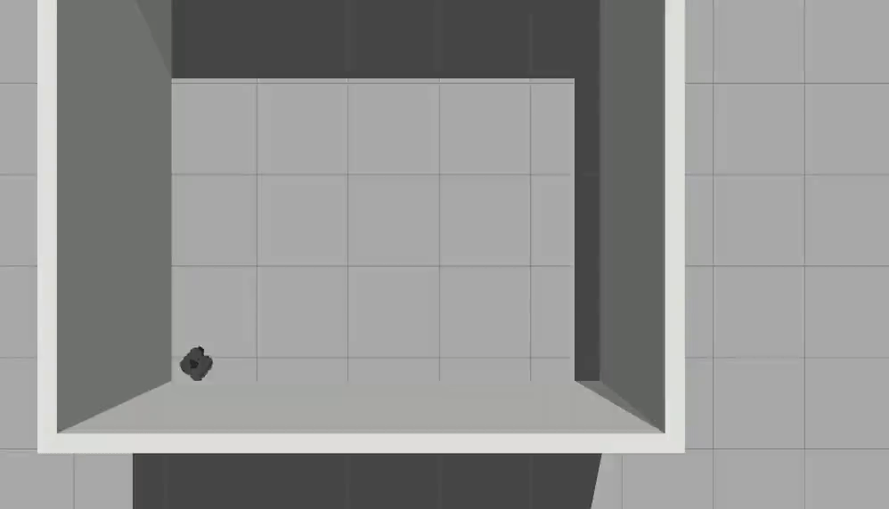

# warmup_project
## Driving in a Square
### High-level approach
*For each robot behavior, describe the problem and your approach at a high-level. Include any relevant diagrams or pictures that help to explain your approach.*

The high level approach for driving in a square was fairly simple. A square is just two sets of parallel lines, joined with right angles. Our robot just needs to move straight for an equal period of time 4 separate times, and turn 90° between each of these periods of straight movement, and the resulting shape will be a square. (You could also turn -90° as long as you are consistent.) 
### Structure of the code
*Describe the structure of your code. For the functions you wrote, describe what each of them does.*

My code is structured around a class called DriveSquare; the only functions written are the __init__ and run methods. In light of the high-level picture described above, the only ROS topic needed for this movement is /cmd_vel. As such, the __init__ method just registers the node and sets up a publisher to /cmd_vel. The run method then just defines a few parameters that affect the time it takes for the robot to traverse the square (such as the linear speed used and the time spent moving in the lines of the square at that speed), and then uses a never-ending while loop to actually traverse the square. Inside the while loop are two steps to continuously draw the lines of a square: first, the linear.x speed is set to the parameter defined earlier, that is published, and the program sleeps for some time, letting the robot move along the line. Then, the linear.x speed is set to 0 and the angular.z is set such that 90 degrees will be rotated in a certain parameterized period of time, which is then waited for. The first step also sets angular.z speed to be 0 so that this does not remain when the lines of the square are drawn.

### Relevant GIFs
*While recording your robot's behavior in a rosbag conducting each type of behavior, also record a gif of the robot visually. Include this gif in your writeup and use it for analysis if needed. For instructions on how to make a gif recording, look at Gazebo simulator.*

The first gif below is a gif of the robot moving in a square using my final code. The second gif is a gif of the robot moving in a straight line with no change in velocity over a long distance--it demonstrates the effect of drift on robot trajectory even without changing velocity. The third gif shows the accuracy with which the robot turns 90° at a time in place when it is not moving linearly--for some reason, the angle seems to be ruined when combined with the linear moving, as you can see in the first gif. Note that all three gifs were created using only slight variations of my final code where different lines were commented out, so the differences are not due to different ways of implementing (although the linear speed is higher in the linear_drift gif for demonstrative purposes). 

### Challenges
*Describe the challenges you faced and how you overcame them.*

The first challenge I faced was that, despite going through exercises in class, I still had a very poor understanding of the general ROS framework/how to work with topics and publish messages. I combated this by going over the work we'd done so far thoroughly, and attending Pouya's office hours on Sunday. The office hours were immensely helpful, as exercise 2 in class uses /cmd_vel as well, and after attending I understood the basic ROS framework well.

Before coming to the high-level idea listed above, I conceived of another idea: for some specified time move in the +x direction, then for the same specified time in the +y direction, then for the same time in the -x direction, and finally for the same period of time in the -y direction. Doing this will create a square if you draw it out. Of course, I ran into lower-level implementation problems here--when I coded it up, the bot would only move in the +x direction and -x direction and not the +y or -y. I asked on slack about this and Jason Lin explained: "The bot can only move forward/backward and spin around because its wheels are fixed to the chassis." I then went back to the drawing board, conceived the high-level idea above, and implemented that.

The final challenge I faced was dealing with the fact that the turtlebot emulates the real world and is not perfect--there is drift, for instance. Despite, I believe, implementing the correct logic behind the high-level idea described above, my turtlebot did not move in a perfect square, as you can see in the gif above. I spent a long time trying to figure out the cause of this. One thing I did, for instance, is import pi from python rather than just using 3.14, to improve the accuracy when turning. In the end, I settled for the resulting gif above. In other experiments, I found that my code with just a few lines changed could cause the turtlebot to rotate seemingly perfectly by 90° at a time IN PLACE, and that it could move approximately linearly (both of these are displayed in gifs above), although drift occured over larger distances/speeds. But, putting together I supposed compounded errors resulting in the imperfect gif of my final code version above. I did not quite overcome this challenge to perfectly move in a square, but I did improve upon facing it and learn from it.

### If I Had More Time, How Would I Improve the Behavior?
*If you had more time, how would you improve your robot behaviors?*

As evidenced by the gif above, my robot doesn't really move in in a square that well. For some reason, combining turning and moving forward leads to the angle turned being wrong. If I had more time, this is what I would spend most of my time on. After thinking about my code for some time, and messaging Pouya on slack, I think that the error with the way I've done it might just be due to the fact that you can only get so accurate moving in a square by relying on rospy.sleep to turn/move for a certain angle or distance. I think that small differences due to noise will compound into an inaccurate path, hence my problems. So, I would probably try an entirely different approach using odometry to improve further.

### Key Takeaways 
*What are your key takeaways from this project that would help you/others in future robot programming assignments? For each takeaway, provide a few sentences of elaboration.*

Working with ROS topics: as mentioned above, starting this project I had a poor grasp of how to handle ROS topics--how to gather information on them, publish to them, and subscribe to them. In having to work on this basic example of robot behavior, I had to learn all about these. While I'm sure I still have a lot to learn, perhaps my biggest takeaway from this will be the understanding of these topics I gained in working through the project

Imprefect robotics: my other big takeaway from this project is that when working with robotics--even if you're just simulating them--you have to deal with real world noise and imperfections. It is very easy to draw out a diagram of a square with perfect 90° angles and say you just need to make the robot move for the same amount of time when going on each line and making the angles--as I did in my high-level summary--but in the real world there is drift and other factors such that even if you code things up well you won't get the result you want. Similarly, the first high-level idea I conceived above described above (that involves moving in the +y and -y directions) makes perfect conceptual sense, but isn't implementable for turtlebot. Robotics don't work in the perfect world of Platonic ideals but in our world, and you need to program taking this into account, and perhaps be willing to accept imperfections. 

# Wall Follower
### High-level approach
*For each robot behavior, describe the problem and your approach at a high-level. Include any relevant diagrams or pictures that help to explain your approach.*
This problem can be broken into several subproblems. First, you need to get to a wall and orient yourself to follow it. Then, you need to follow the wall, making sure that you stay straight. And third, you need to handle corners/turn at them. My approach was to attack these subproblems separately, using a class held state variable to note which one I was working on. The first subproblem just involved moving and then turning such that the robots right faced the nearest wall,
 the second involved looking at the distance to the first object at angles 225 vs 315 and trying to equalize them to keep straight, and the third involved using PID to turn until the robots left once again faced the nearest wall.
 
### Structure of the code
*Describe the structure of your code. For the functions you wrote, describe what each of them does.*
My code is structured within a WallFollower class that stores state regarding which subproblem we are on. 
-init: we setup a publish to \cmd_vel and a subscriber callback, scan_callback, for /scan. We set the initial state to MOVE_TO_WALL
-scan_callback: This function just forwards the scan data to the relevant handler depending on the current state 
-move_to_wall: state handler for the subproblem of moving to the wall. First, checks if the nearest object is close enough for us to follow it as a wall. If so, the function uses PID to turn untl its right side is facing that wall, changes the state variable to FOLLOW_WALL, and returns. Otherwise, it just moves in the direction of then nearest object.
-follow_wall: After some setup, checks if we are at a corner by seeing if the object straight ahead of the robot is quite close. If so, sets the state to CORNER and returns. Otherwise, we just need to keep following the wall and keep straight. To do this, the function compares the distance to the nearest object at angle 225(counterclockwise from the from of the robot) and 315. We are going straight if and only if they are equal, so we try to keep them equal; if one is larger, we turn to counter that. 
-handle_corner: First, checks if the robots closest point to a wall is its left face (using reorient_needed, described later). If not, then we need to keep handle turning the corner. We do this by setting the angular velocity using a PID and also keeping a small linear velocity. This results in the corner turning (usually). If the robots closest point to a wall is its left face though, we are done handling the corner and depending on how far we moved from the wall in handling the corner we either switch state to MOVE_TO_WALL or FOLLOW_WALL.
-compute_PID: Helper function that just takes a K value and and error value and returns the product (PID); used to make code cleaner. 
-reorient_needed: Helper function that just checks if the robots closest point to a wall is its left face; returns true if not, in which case the robot needs to "reorient." Takes as parameters the current angle to nearest object, the desired angled for it, and the tolerance in that desired angle. 
-argmin_min: Helper function called in lots of the others that, given an array of values, returns a tuple of the form (index of minimum value, minimum value). Used to find the angle of the nearest object to the robot and the distance to that object using data.ranges (where data is the input to the callback given when subscribing to \scan).
-run: Basic function that just calls rospy.spin() to keep the scan subscription data flowing without the program ending.

### Relevant GIFs
*While recording your robot's behavior in a rosbag conducting each type of behavior, also record a gif of the robot visually. Include this gif in your writeup and use it for analysis if needed. For instructions on how to make a gif recording, look at Gazebo simulator.*

First gif: gif of my final code running. Second gif: example of problem I ran into: spinning for a long time at corners. Third gif: Example of another problem I ran into: loops at corners before performing correct turn.

### Challenges
*Describe the challenges you faced and how you overcame them.*
I had a ton of trouble with this assignment. The first challenge I faced was conceptualizing the stages of the problem/figuring out how to approach it. I solved this challenge by attending Sarah's office hours, which greatly elucidated the problem for me. In particular, I got the idea for looking at the distance to the nearest object at angles 225 and 315 in order to keep straight on a wall, from her. Then, when programming, I got confused about how to move towards a desired angle using the interface of angular velocity. At first I just tried setting angular velocity to the desired angle! After thought and review of other work, in particular the prior class, I realized PID could be used; this technique was super useful. A final challenge I faced was detecting and turning corners. I had several ideas on how to detect them, but they all had problems (getting stuck due to going too deep into corner or stuck in infinite loops as seen in the gif above), and similar for how to move through them. I improved my robots behavior mostly through trial and error here of all the different ideas, but didn't fully conquer the challenge. 

### If I Had More Time, How Would I Improve the Behavior?
*If you had more time, how would you improve your robot behaviors?*

The bigget thing I would change with more time is improving corner behavior. Although sometimes the robot will successfully and cleanly traverse corner after corner, sometimes it gets stuck against walls, stuck in a long loop as seen in the third gif, or makes a strange loop to complete a turn as seen in the second gif. I think that the this could all be improved by changing up the detection method of corners and the method of turning them. Another thing I would improve on is the code structure. I initially went for a state based model with three states-move_to_wall, follow_wall, and corner. This works OK, but as I got later in the process I felt like it was a little unclean/more states would be helpful. One thing that seemed bad to me is that move_to_wall requires reorienting and as does turning a corner, so perhaps some code could be put into another state to prevent duplication. Also, sometimes the robot gets to close to the wall, and another state to handle moving it further when that happens would be helpful. 

### Key Takeaways 
*What are your key takeaways from this project that would help you/others in future robot programming assignments? For each takeaway, provide a few sentences of elaboration.*

* My biggest takeaway from this project is that, even though guessing and fine-tuning can get you results, it takes a LOT more time than just sitting down and thinking things through conceptually. I spent far too long trying to fine-tune my code for corners with small changes that didn't change much until I decided to sit down and think it through fully, which helped a lot. I think doing it more and sooner would have stopped me from having a robot that sometimes does not turn well. 

* Another big takeaway for me from this project is a much improved understanding of PID. After the class exercise I didn't really get it, but when I had to think about how to get my program to turn/reorient and employ it multiple times it finally sunk in quite well.  Everywher I applied it I think going about it differently would have taken a lot more code and more precise code, which makes it a very powerful concept. 

# Person Follower
### High-level approach
*For each robot behavior, describe the problem and your approach at a high-level. Include any relevant diagrams or pictures that help to explain your approach.*

The task can be broken down into a few steps: turning towards the nearest object, moving towards the nearest object, and knowing to stop when you get close to the object. To solve the problem, I just had to make the robot do each of these tasks independently: turn towards the object while moving towards it, and if you get close or are facing it, stop turning/stop moving.

### Structure of the code
*Describe the structure of your code. For the functions you wrote, describe what each of them does.*

The code is a very basic ROS program all within a PersonFollower class. The class has an init function which sets up publishing and subscribing to /cmd_vel and /scan respectively. The work of the program is in the function scan_callback, which is the subscription function for scan. Whenever it receives data, it finds the distance to the closest object and its corresponding angle by iterating through data.ranges. It then updates the angular velocity using a basic PID update if the robot is not facing the object or sets it to 0 if it is facing the object, and sets the linear velocity to a constant 0.3 value unless the robot is within 0.5 of the object in which case it updates it to 0. There is also a basic run function that just calls rospy.spin() to keep the code running.

### Relevant GIFs
*While recording your robot's behavior in a rosbag conducting each type of behavior, also record a gif of the robot visually. Include this gif in your writeup and use it for analysis if needed. For instructions on how to make a gif recording, look at Gazebo simulator.*

### Challenges
*Describe the challenges you faced and how you overcame them.*
Conceptually this problem was not very challenging, and any trickiness the implementation's details might have solved were greatly ameliorated by having first spent lots of time on WallFollower. The biggest challenges I faced were deciding how to handle getting the robot to stop turning/moving when it was facing the object/near to it and choosing the k value to be used in PID. The former challnege just required some thinking at which point I realized I could just set the velocities to 0 if we were close enough to the desired value. The latter challenge was solved by seeing what values of k I had used in other programs and experimenting based on that.

### If I Had More Time, How Would I Improve the Behavior?
*If you had more time, how would you improve your robot behaviors?*
While I think my robot achieves all the asked for goals pretty well, it does sometimes, when it gets to an object, spin more than it needs to (for instance, doing a 360 before stopping facing the object; this can be witnessed in my gif briefly). If I had more time, I would try to fix this problem, which I think is caused by variation in the angle of the nearest object that happens when you get close to an object. To expand the robots behavior, I would also explore how it behaves when you add lots of objects around it, as there might be a similar problem in that case where the angles lead the robot to move quite indirectly or not be able to decide which object to go to since more than one may appear to be the closest object at different moments in its movement.

### Key Takeaways 
*What are your key takeaways from this project that would help you/others in future robot programming assignments? For each takeaway, provide a few sentences of elaboration.*

* My first takeaway is that to get PID to work with angles you generally need to have a very small k value. I first started trying to point at the object using k values ~50 times as large as the one I ended up using and the robot continuously spun. More generally, I could say I learned that you should experiment with vastly different values for k, as something 100x larger or smaller may be what you need, which is a wider range of values than I am used to experimenting with.

* Turning is weird and hard to get right with the methods I have been using. All the things I would improve if I had more time involve the robot spinning too much, and I had similar problems with the wall follower. Its easy to overshoot an angle and then if you're only turning one way, have to keep spinning a whole other rotation. This also means that small/natural fluctuations in the nearest angle can cause a whole extra rotation.
